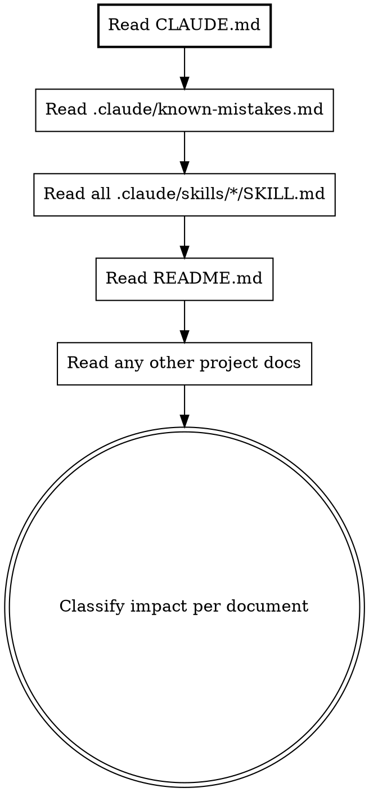

# Feedback Loop — Document Integrity Guard

After completing any task, audit the entire document hierarchy against the changes made. Update what's stale, flag what's missing, propose new documents when existing ones can't cover a new pattern.

<HARD-GATE>
This skill runs AFTER the task is done. Do NOT skip. Every code change is a potential documentation gap.
</HARD-GATE>

## Checklist

1. **Collect evidence** — what changed in code and workflow
2. **Scan document hierarchy** — read every document, check relevance
3. **Classify impact** — update / create / no action per document
4. **Execute updates** — apply changes, create new docs if needed
5. **Report** — present a summary table to the user

## Step 1: Collect Evidence

```bash
git diff HEAD~1 --stat
git diff HEAD~1
git log -1 --format="%B"
```

Also review conversation context:
- What was the original goal?
- What approaches were tried and abandoned?
- What was surprising or non-obvious?
- Were any mistakes made along the way?

## Step 2: Scan Document Hierarchy

Read ALL of these. No skipping.



For each document, ask:
- Does the change make any statement in this document **stale or wrong**?
- Does the change introduce knowledge that **should be in this document but isn't**?
- Does the change reveal a pattern that **no existing document covers**?

## Step 3: Classify Impact

For each document, assign one verdict:

| Verdict | Meaning |
|---------|---------|
| **UPDATE** | Content is stale or incomplete — needs editing |
| **CREATE** | A new document is needed — existing docs can't cover this |
| **OK** | No action needed |

### When to UPDATE

- CLAUDE.md: project structure changed, build commands changed, tech stack changed, workflow changed
- known-mistakes.md: a mistake was made that future Claude would repeat
- Skill SKILL.md: the skill's process, checklist, or assumptions are now wrong
- README.md: public API changed, usage examples outdated

### When to CREATE a new document

Propose a new document when you detect a **recurring pattern** that doesn't fit any existing document:

| Signal | Proposed document |
|--------|-------------------|
| Multiple related mistakes in the same area | A dedicated known-mistakes section or category file |
| A new skill is needed to prevent recurring workflow errors | New skill in `.claude/skills/` |
| A new subsystem was added with non-obvious usage | A reference doc for that subsystem |
| The project structure has a new convention | Update CLAUDE.md or create a conventions doc |

**Do NOT create documents speculatively.** Only propose when the evidence from this task clearly demands it.

## Step 4: Execute

### For UPDATE verdicts

Edit the document directly. Keep changes minimal and focused — only fix what this task's changes affect.

### For CREATE verdicts

Present the proposal to the user BEFORE creating:

> **Proposed new document:** `[path]`
> **Why:** [one sentence — what gap does it fill?]
> **Content preview:** [2-3 bullet points of what it would contain]

Wait for user approval. Do not create without it.

### For known-mistakes.md specifically

Use this entry format:

```markdown
### [Short title]

**What went wrong:** [One sentence]
**Why it's wrong:** [Why the wrong approach seemed right]
**What to do instead:** [The correct approach]
```

## Step 5: Report

Present a summary table to the user:

```
| Document | Verdict | Action taken |
|----------|---------|-------------|
| CLAUDE.md | OK | — |
| known-mistakes.md | UPDATE | Added entry: "..." |
| authx-brainstorming/SKILL.md | OK | — |
| (new) .claude/xxx.md | CREATE | Proposed to user |
```

If everything is OK, say so in one line. Don't over-explain.

## Key Principles

- **Scan everything** — Don't guess which docs are affected. Read them all.
- **Be selective** — Most tasks won't need any doc updates. That's fine.
- **Be specific** — "Needs update" is useless. Show the exact stale content and the fix.
- **Propose, don't assume** — New documents need user approval. Updates to existing docs don't.
- **No fluff** — If a known-mistakes entry is longer than 5 lines, it's too long.
